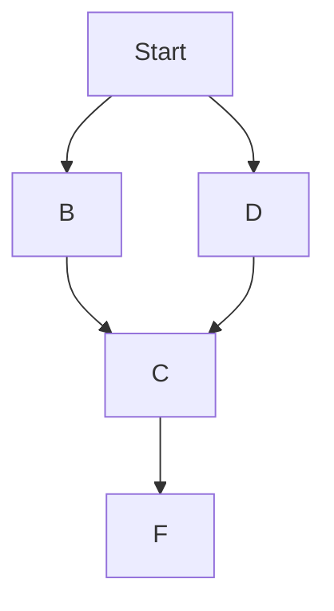

#블로깅 테스트 
## 가나다 
### 가나다라

```python
def print_hi(name):
  print("hello", name)
print_hi('Tom')
```

가나다.
```
test
```
#가
##나
###다
####라

1

| column | column |
|--------|--------|
| asdf   |   asdf |
| 가나다   | 가나다|
| 가나다   | 가나다|
| 가나다   | 가나다|
| 가나다   | 가나다|
| 가나다   | 가나다|


```
printf("Hello World");
```

이것은 ==강조== 구문

Thie **Bold** type


1. 리스트 
2. 리스트
3. 리스트
4. 리스트

[google.com](http://google.com)


[TOC]
Markdown

$$$$$$
aa
$$$$$$

$$

$$

*aa*


$x^2$ or $$x^2$$



- [x] first task
- [x] second task is done
- [x] third task

## slide1 title

slide2 content

***

## slide2 title

slide2 content

```
var your = 'code here';
```

* RED
* GREEN

- RED
- RED


+ RED
+ GREEN


Check out the [Jekyll docs][jekyll-docs] for more info on how to get the most out of Jekyll. File all bugs/feature requests at [Jekyll’s GitHub repo][jekyll-gh]. If you have questions, you can ask them on [Jekyll Talk][jekyll-talk].

[jekyll-docs]: https://jekyllrb.com/docs/home
[jekyll-gh]:   https://github.com/jekyll/jekyll
[jekyll-talk]: https://talk.jekyllrb.com/
